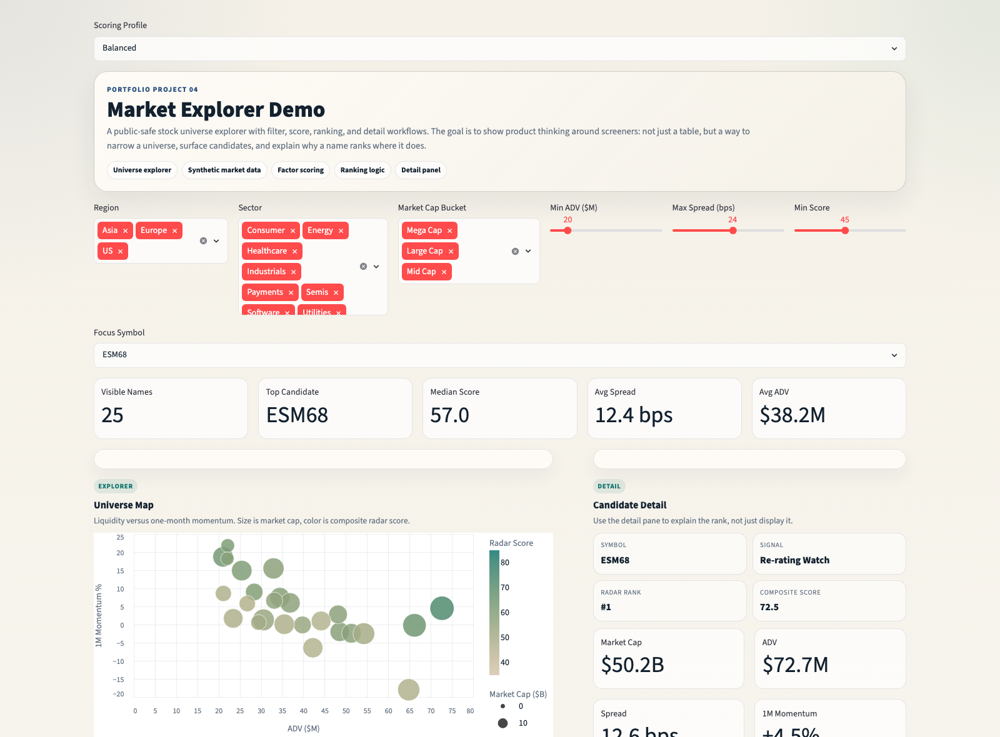

<div align="center">
  <h1>Market Explorer Demo</h1>
  <p><strong>An explorer / screener for filtering, scoring, ranking, and inspecting a market universe.</strong></p>
  <p>Designed to feel like a real internal data product rather than a single dashboard table.</p>
</div>

<p align="center">
  <code>explorer</code>
  <code>screener</code>
  <code>ranking logic</code>
  <code>factor scoring</code>
  <code>streamlit product demo</code>
</p>

## Preview



## Overview

Instead of stopping at a dashboard table, this project demonstrates a fuller workflow:

1. filter a universe
2. apply a scoring profile
3. rank candidates
4. inspect a detail pane
5. explain why a name is surfacing

Everything in this repo is synthetic and safe to publish.

## Highlights

- a stock universe explorer with filters for region, sector, liquidity, spread, and score
- a composite ranking model built from liquidity, momentum, quality, and value pillars
- a board of ranked names for monitoring or export
- a detail panel with synthetic price history and factor breakdown
- a UI that reads like a real internal data product rather than a notebook screenshot

## Ranking Profiles

The app supports multiple ranking profiles:

- `Balanced`
- `Liquidity First`
- `Momentum`
- `Defensive`

Each profile reweights four pillars:

- `Liquidity`
- `Momentum`
- `Quality`
- `Value`

This makes the explorer feel more like a real screener product, where the ranking logic changes depending on the use case.

## Quick Start

```bash
python3 -m venv .venv
source .venv/bin/activate
pip install -r requirements.txt
streamlit run app.py
```

## Project Structure

```text
market-explorer-demo/
├── app.py
├── README.md
├── requirements.txt
└── src/
    ├── __init__.py
    ├── explorer.py
    └── ui.py
```

## Notes

- All symbols, company names, metrics, rankings, and price histories are synthetic.
- The app focuses on explorer / screener product design and ranking workflows.
